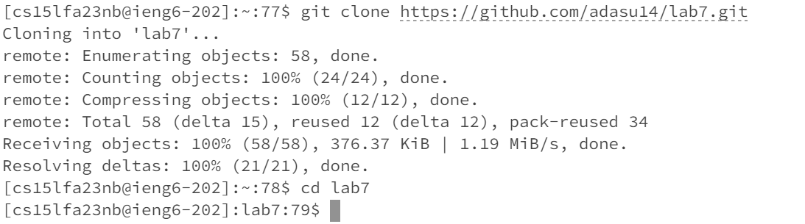
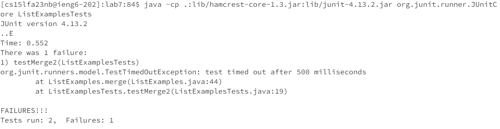
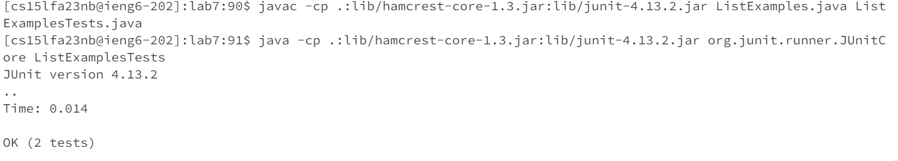
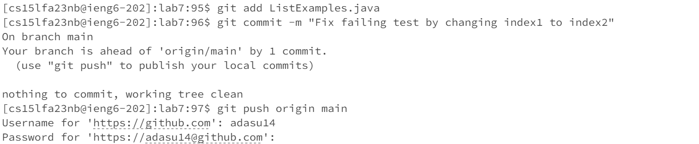

# Lab Report 4

**Log into ieng6**


**Clone your fork of the repository from your Github account**


**Running the tests**


**Edit the code file to fix the failing test**
After this, I did the command
```vim ListExamples.java```

This was followed by:

'j' 43 times,
'l' 11 times,
'x' 1 time,
'i' 1 time,
'2' 1 time,
esc 1 time,
':w',
enter,
':wq',
enter

**Run the tests**


**Commit and push**
